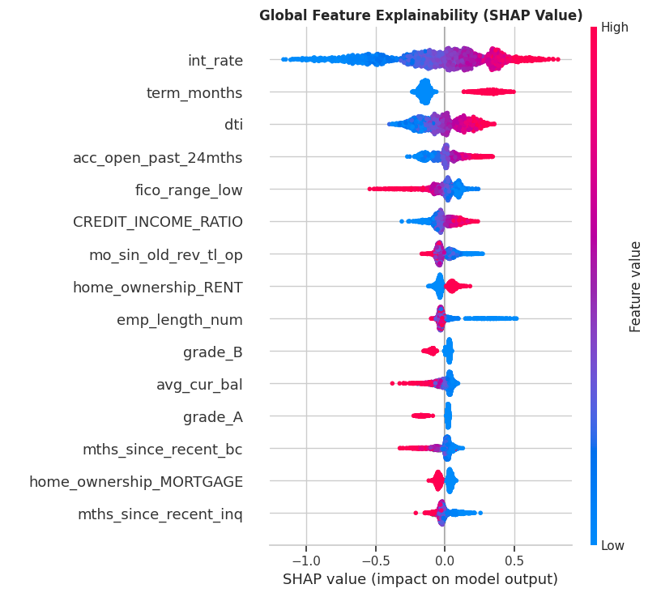

# Credit-Risk-Project
# 🏦 End-to-End Credit Risk Scoring & Explainable AI Pipeline

## 📖 Project Overview
This project develops a production-ready machine learning pipeline to predict credit loan defaults using the Lending Club dataset (150,000+ records). It is specifically designed to simulate a strict real-world underwriting environment by aggressively preventing data leakage and emphasizing model interpretability (Explainable AI) for regulatory compliance.

## 🚀 Key Highlights & Business Value
* **Robust Anti-Leakage Pipeline:** Deliberately identified and removed post-origination features (e.g., `last_fico_range`, `recoveries`, `settlement_status`) that artificially inflate model performance. The model relies strictly on data available at the time of the loan application.
* **Actionable Risk Segmentation:** Transformed raw probability outputs into a 10-tier Decile Risk Matrix. 
  * **Business Insight:** By auto-rejecting the bottom 20% of applicants (Risk Bands 9 & 10), the strategy successfully mitigates **~50% of total charge-offs** while ensuring a seamless auto-approval process for top-tier low-risk applicants.
* **Financial Leverage Engineering:** Engineered critical risk indicators such as **Credit-to-Income** and **Installment-to-Income** ratios to better capture borrower affordability constraints.

## 🧠 Explainable AI (SHAP) & Risk Drivers
In highly regulated financial environments (e.g., OSFI/CFPB guidelines), black-box models are unacceptable. I deployed **SHAP (SHapley Additive exPlanations)** to interpret the XGBoost predictions globally and locally.

*(Ensure the `shap_summary.png` file is uploaded to your repository to display this image)*

**Key Underwriting Insights:**
1. **Initial Interest Rate (`int_rate`):** Acts as a strong proxy for perceived risk during initial pricing; higher rates correlate heavily with eventual default.
2. **FICO Score (`fico_range_low`):** Subprime scores exponentially drive up SHAP risk values, perfectly aligning with standard US credit behavior.
3. **Loan Term (`term_months`):** 60-month terms carry significantly higher risk exposure than 36-month terms due to macroeconomic uncertainties.

## 📊 Model Performance
* **ROC-AUC Score:** `0.725` (A highly realistic and robust metric for unsecured personal credit risk, achieved *after* stripping all future data leakage).
* **High-Risk Recall:** Successfully captured 65% of true defaults.

## 🛠️ Technology Stack
* **Language:** Python
* **Algorithms:** XGBoost (Gradient Boosting), optimized with `scale_pos_weight` for extreme class imbalance.
* **Explainability:** SHAP
* **Data Processing:** Pandas, NumPy, Scikit-Learn
* **Visualization:** Matplotlib, Seaborn

## 📂 Repository Structure
* `Lending_Club_Underwriting_Model.ipynb`: The complete Jupyter Notebook containing data extraction, feature engineering, model training, and SHAP visualizations.
* `requirements.txt`: Environment dependencies.
